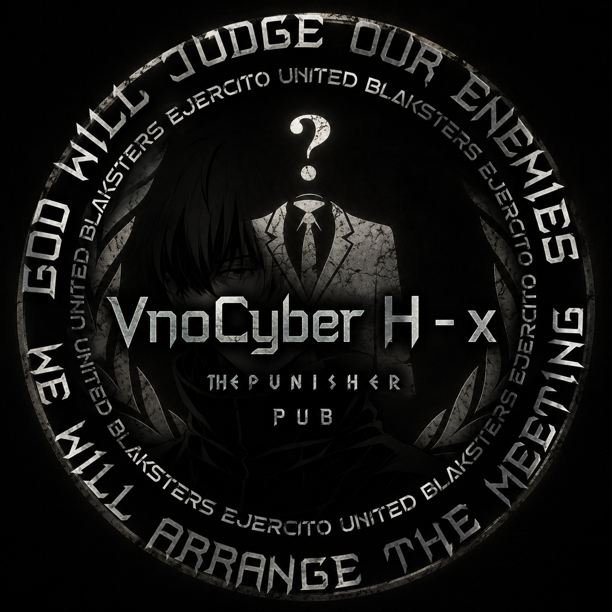

# VnoCyber H-X

<p align="center">



</p>

<p align="center">

Premium Pterodactyl Panel Hosting Website

Cyber • Glassmorphism • Futuristic • Responsive

</p>

---

## Tentang

VnoCyber H-X merupakan website hosting modern yang dibuat untuk menjual layanan **Pterodactyl Panel** dengan tampilan cyber premium, animasi futuristik, serta desain Glassmorphism.

Website ini dibuat menggunakan teknologi web murni sehingga ringan, cepat, dan mudah dijalankan di berbagai perangkat.

---

# Fitur

- Premium Cyber UI
- Glassmorphism Design
- Responsive Desktop & Mobile
- Particle Background
- Animated Hero
- Live Server Dashboard
- Loading Screen
- Scroll Progress
- FAQ Accordion
- Pricing Comparison
- WhatsApp Order
- Telegram Order
- SEO Ready
- Fast Loading
- Modern Animation

---

# Paket Panel

| Paket | RAM |
|-------|------|
| Starter | 2 GB |
| Standard | 3 GB |
| Premium | 4 GB |
| Pro | 5 GB |
| Enterprise | Unlimited |

---

# Struktur Project

```text
VnoCyber H-X/
│
├── index.html
├── pricing.html
├── about.html
├── contact.html
├── 404.html
│
├── style.css
├── pricing.css
├── about.css
├── contact.css
│
├── script.js
├── pricing.js
├── about.js
├── contact.js
│
├── LICENSE
├── README.md
├── robots.txt
├── sitemap.xml
├── manifest.json
│
└── assets/
    ├── images
